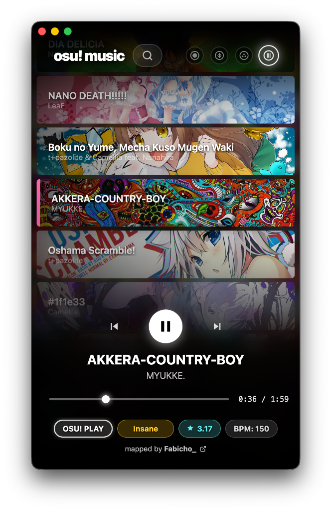

# osu!music

  

This application automatically detects your local osu! installation and allows you to browse and play your beatmaps seamlessly.
Minimalist music player for your **osu! beatmaps** library, designed with the sleek aesthetics of **osu!lazer** in mind. Built for situations when you can’t or don’t want to play osu!, but still want to listen to the music from beatmaps.

 

<b>View fullsize window</b>

 

## Features

- **Lazer-Inspired UI**: Interface with vibrant card backgrounds and smooth animations.
- **Beatmap Integration**: Automatically detects and plays music directly from your osu! installation.
- **Search**: Real-time filtering with support for Unicode titles and artist names.
- **Audio**: Playback powered by Howler.js.

## Installation

1. **Download**: Grab the latest `.dmg` from the **[Releases](https://github.com/xtx-junkcode/osumusic/releases)** page.
2. **Install**: Open the `.dmg` file and drag **osu!music** to your **Applications** folder.
3. **Launch**: Find **osu!music** in your Launchpad and open it. 
   > *Note: If macOS prevents opening, go to System Settings > Privacy & Security and click "Open Anyway".*

## Tech Info

Frontend: React 19 + TypeScript + Vite
Animations: Framer Motion
Desktop: Electron 40.6.0
Database: Realm (MongoDB)
AI: Gemini 3.1 Pro

Created with Gemini 3.1 by tonixtx
